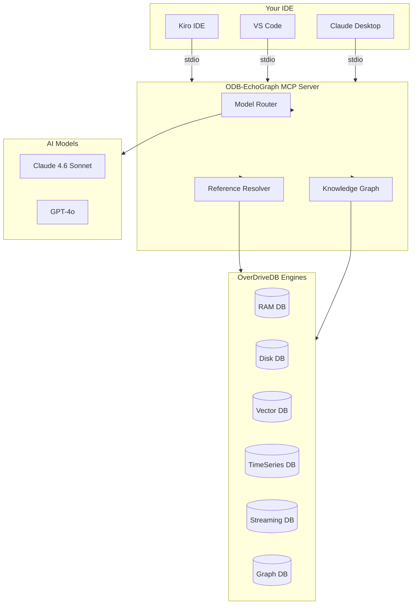

# ODB-EchoGraph (OverDrive AI Agent)

[](https://www.npmjs.com/package/odb-echograph)
[](https://opensource.org/licenses/MIT)
> Built by **mr.v2k**

> AI coding agent using all 6 OverdriveDB engines with 60–80% token reduction, model-agnostic context switching, and persistent knowledge storage. Fully integrated via the Model Context Protocol (MCP).

## 🚀 How to Add to Your IDE (MCP Setup)

The best part about MCP is that your IDE **automatically starts the server in the background** when you open your editor. You do not need to manually start it on a port, and you don't need to run any REST API servers!

### VS Code / Claude Desktop / Kiro IDE Configuration

Add the following to your IDE's MCP settings file (e.g., `settings.json` for VS Code, or `claude.json` for Claude Desktop):

```json
{
  "mcpServers": {
    "odb-echograph": {
      "command": "npx",
      "args": ["-y", "odb-echograph"]
    }
  }
}
```

*Note: If you are running it locally from your cloned source code instead of NPM, change the command to `"node"` and the arg to `["/absolute/path/to/x:/OBD-intnero/mcp-server.js"]`.*

---

## 📊 Architecture & Data Flow

Here is how ODB-EchoGraph connects your IDE to the AI models and the 6 Database engines to save you tokens:



---

## ✨ Core Features

- **Model-Agnostic**: Switch between Claude, GPT-4, Gemini mid-session — context never lost.
- **60-80% Token Reduction**: Compressed context graphs vs raw chat history, zero quality loss.
- **Persistent Knowledge**: Graph DB stores reasoning chains, code patterns, task history.
- **Reference Resolution**: User says "fix that" → AI knows exactly what "that" is by querying the graph.
- **Zero API Required**: Communicates directly over `stdio` via MCP. No ports, no REST API overhead.

---

## 🧠 The 6 OverDriveDB Engines

1. **Graph DB**: Task nodes, reasoning chains, code dependencies.
2. **Vector DB**: Code embeddings (384-dim) for semantic search.
3. **TimeSeries DB**: Token usage, latency, quality per call.
4. **Streaming DB**: Async task queue, agent event bus.
5. **RAM DB**: Current session context and model handoff snapshots.
6. **Disk DB**: Persistent knowledge base and patterns.

---

## 📁 Where is my Data Saved?
Because ODB-Echograph runs locally, your data is completely private. 

Whenever you run the MCP server or the `odb-dashboard` command, OverdriveDB will create `.odb` database files (like `agent-graph.odb` and `agent-vectors.odb`) **directly inside the folder you ran the command from**. 

*If you open VS Code in `C:\Projects\MyProject`, the `.odb` files will be saved in `MyProject`, keeping your agent's memory scoped exactly to that specific project!*

---

## ⚡ Performance & Token Reduction

**Raw chat history approach** (15,000+ tokens):
`[message 1] [message 2] ... [message 50] -> Full history every call`

**ODB-EchoGraph approach** (400-600 tokens):
```text
priorReasoning (3 summaries)   ≈ 150 tokens
recentSignatures (3 functions) ≈ 100 tokens
relatedPatterns (3 patterns)   ≈ 100 tokens
current task                   ≈ 50  tokens
─────────────────────────────────────────
Total per call                 ≈ 400-600 tokens (60-80% reduction)
```

---

**Built with pride by mr.v2k**
*AFOT (All For One Tech)*
